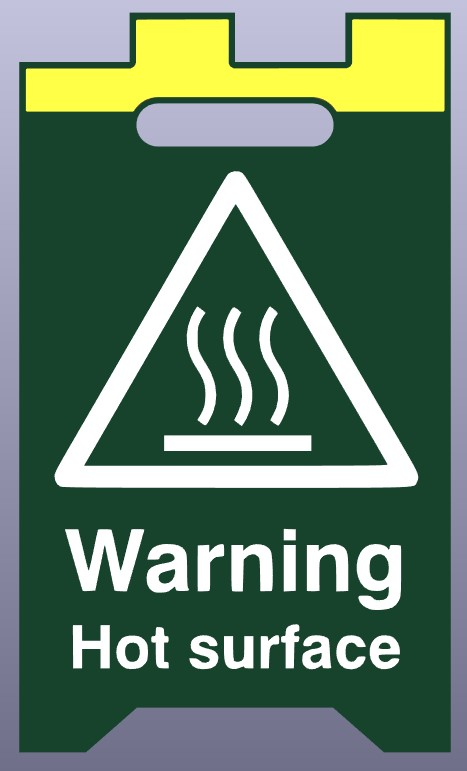
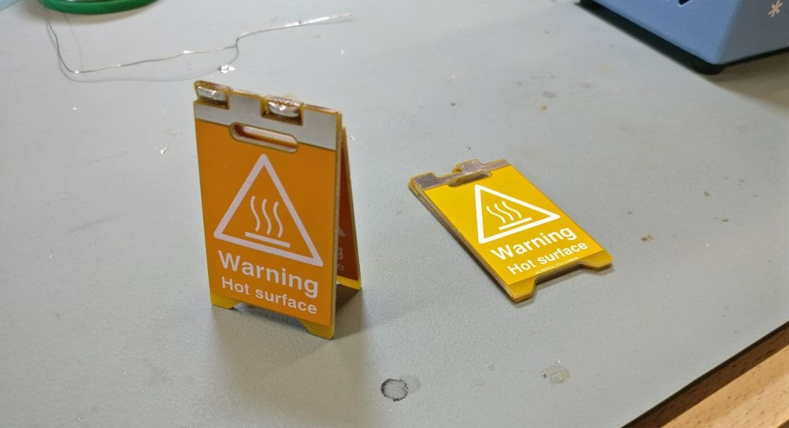
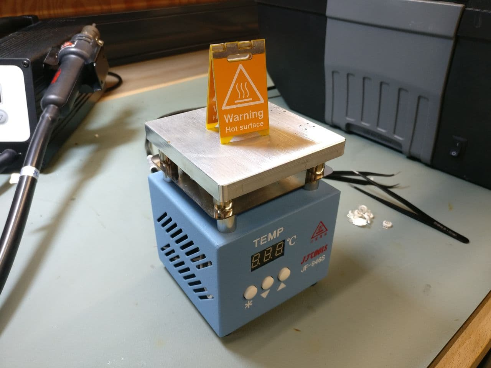
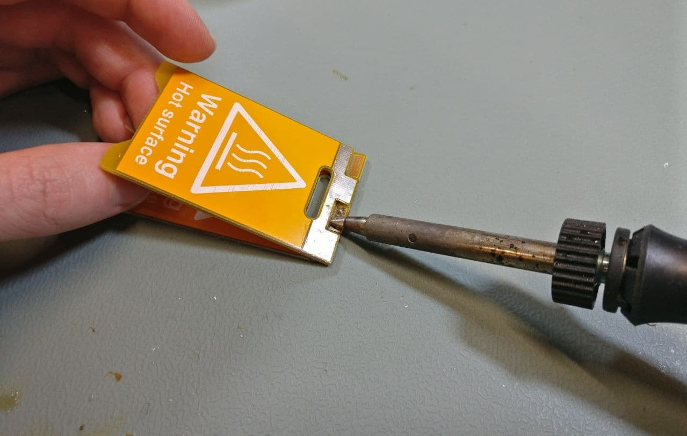

# Caution Hot PCB Sign
Just a simple heat resistant "Caution Hot" sign made out of two PCBs. The PCB is a 2 layer board measuring 1.38 x 2.36 inches (35.0 x 60.0mm).

> :warning: **This board was created with KiCad Nightly (5.99).** Exported gerbers are in `CautionHot_gerber/`, so you can order PCBs without installing this version of KiCad.

|  |  |  |
| ------------------------------------------ | --------------------------------------- | ----------------------------------- |
| Layout in KiCad                            | Finished sign                           | Sign in use                         |

## How To Solder
It's best to lay one PCB flat, hold the other one above it at an angle and just flood the lower pad with solder. It'll then wick in between the PCBs and solder them together quite well.

